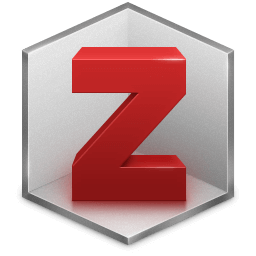

It might be surprising that as a psychotherapist, I'm writing about open-source software.  But there are a few tools that I am very grateful for, as they contribute daily to making my life less stressful.  I'm a Mac user, so everything here is Mac-centric.  These are not in-depth reviews, although they may come later, so consider them as recommendations.

## Zotero

For reference management, it has to be [Zotero](https://www.zotero.org).  The self-ascribed 'personal research assistant' makes it easy for me to keep track of, organise, and cite my ever-expanding collection of papers, articles, and PDFs.

Zotero means that I don't have to spend much time keeping track of where I've stored things as everything is in Zotero.  At some point, I might move away from this, but for now, it's advantageous.  Everything syncs between my work and home computers and is also available through the Zotero web interface.  You can choose to host full-text versions of your files with Zotero as I do, so it doesn't matter where I am when I add something to the collection.

There are some Zotero plugins which extend usability significantly:

* [Zotfile](http://zotfile.com), which among other things extracts highlight and annotations from PDFs.
* [Better Bibtex](https://github.com/retorquere/zotero-better-bibtex) for citation keys and latex.
* And the built-in support for both Word and Libre Office which means you can cite directly from Zotero within your word-processing application, in the correct style (there are many already configured), and automatically generate your reference list or bibliography.

## Libre Office

For a long time, I felt that it was just inevitable that I had to have Microsoft Office because of the number of people who *require* files in .doc or .docx formats, or else send them through to me.  No, I'm not sure why either.  And then I discovered [Libre Office](https://www.libreoffice.org).  It is a complete office package, and it more or less succeeds (with some occasional failings in the more complex spreadsheet functions).

I previously used Libre Office extensively for my writing, and the Zotero integration saved me many headaches of manually checking references.  In truth, I most frequently use it now to produce text documents in .docx formats when that is the only option, but still, it's great software and handy to have around.

## Zettlr

A relative newcomer, I recently discovered the Zettelkasten concept for what I guess would be called knowledge management. Essentially a series of interlinked plaintext files.  You can read more about the methodology over at [Zettelkasten](https://zettelkasten.de).  What would be (and indeed was originally) a highly manual task of making that useful is powered by [Zettlr](https://zettlr.com) which is primarily a markdown editor, but with added Zettelkasten functionality.

I'm currently in the process of moving my notes about books and papers away from Zotero and into Zettlr.  Zotero will remain integral as a reference manager, but Zettlr gives me more flexibility in how I arrange and link my notes (and so thoughts).  For me, one of the best features is the Zotero integration, so again, I can cite and reference easily.  This move is part of a more general shift towards using plaintext files wherever possible, enabling me to maintain as far as possible software agnostic position.

Zettlr also provides a range of export options, creating HTML, PDF, and Word format documents amongst others.  Export customisation is essentially limitless through the internal use of [Pandoc](https://pandoc.org).

## Inkscape

When it comes to producing graphics with any complexity, [Inkscape](https://inkscape.org) is my goto.  Targetted at vector graphics (of course you can also export in a wide range of image formats) Inscape is feature-rich and relatively easy to use.  My needs are modest, much like my graphic design skills, but a look at the [gallery](https://inkscape.org/gallery/) indicates the incredible capabilities.